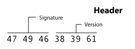
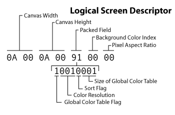
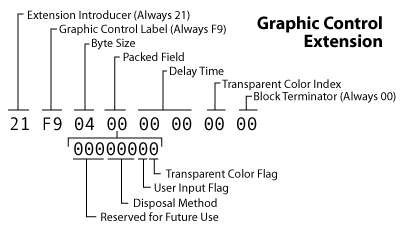
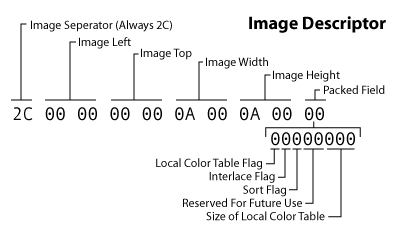
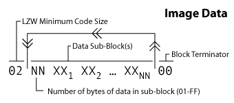
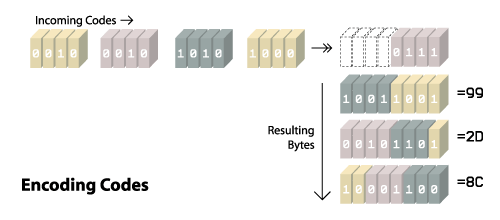
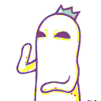

# CMPT-365-Final
(PDF doesn't support GIF, for GIF demo, please see our [web version report](https://github.com/Lyken17/CMPT-365-Final))

# how to use
Load `scr` folder in matlab, then run.

# external libraries
* built-in function `VideoReader` to extract frame from video.

# algorithms details
We implemented the algorithm by following the GIF standard `GIF89a`. The spefication document we refers is [w3 GIF89a specifics](https://www.w3.org/Graphics/GIF/spec-gif89a.txt). Also, we get a lot of help from the intuitive explanation by [3MF project](http://www.matthewflickinger.com/lab/whatsinagif/bits_and_bytes.asp).

Overall structure is shown below, as documentation defines, not all parts are necessary. So in our implementation,  `Comment Extension`, `Plain Text Extension`, `Local Color Lookup Table` are ignored.

## Header Block  

The first six bits of GIF file tells which format it is going to use. We set it to `47 49 46 38 39 61` (ASCII code of `GIF89a`)

## Logical Screen Descriptor

Logical Screen Descriptor defines the window size of GIF, and a lot of options affecting later encoding. Our setting is shown as below

option | value
--- | ---
canvas width | same as video
canvas height | same as video
global color table flag | True (we don't use local color table in project)
color resolution | 8 (256 color)
sort flag | False
size of global color table | depend on video
background color index | 0
pixel aspect ratio | 0

PS : as for `aspect ratio`, we are not sure how it works in GIF. According to  [3MF project](http://www.matthewflickinger.com/lab/whatsinagif/bits_and_bytes.asp), most GIFs set it to zero, so we simply follow them.

## Global Color Table

The color resolution is defined in previous part (depth 8, 256), hence 3 bits are used for every color entry. We quantise frame color to 256, then insert color into binary stream bit by bit.

color | length
--- | ---
R  |  3
G  |  3
B  |  2

## Graphical Control Extension

There are many flags in this block. The most important one, we want to mention here, is the `Delay Time`, we set it to `video_total_time / frames` to make GIF have the FPS with video.

## Image Descriptor

This block defines relative position of each frame based on GIF windows. The project doesn't involve any animation using relation positions and the local color table is not used, hence we do not set any special flag in this block

## Application Extension
Mysterious block, we don't figure out its exact usage, we simply follow what others did -- set it to `21 FF 0B 4E 45 54 53 43 41 50 45 32 2E 30 03 01 05 00 00` (the ASCII code of `NETSCAPE 2.0`).

## Image Data

This is the core part of image representation. All the image data block starts with a LZWMin which indicates the color bits then it follows several data blocks. After mapping color to corresponding index in color table, we then flat all pixels row by row to 1D array. For each image, we apply LZW encoding on the array to get `image data`.

The size of block should be identical to the size of LZW table at each time. As the table size becomes 2^13, insert a clear code inside and reset the LZW table. The `image data` is then split them by 256, and encoded in binary stream, until last chunk is met.
# Demo
examples | examples
--- | ---
 | 
 | 
 | 

# Reference

[w3 GIF89a specifics](https://www.w3.org/Graphics/GIF/spec-gif89a.txt)

[What's In A GIF - Bit by Byte](http://www.matthewflickinger.com/lab/whatsinagif/bits_and_bytes.asp)
